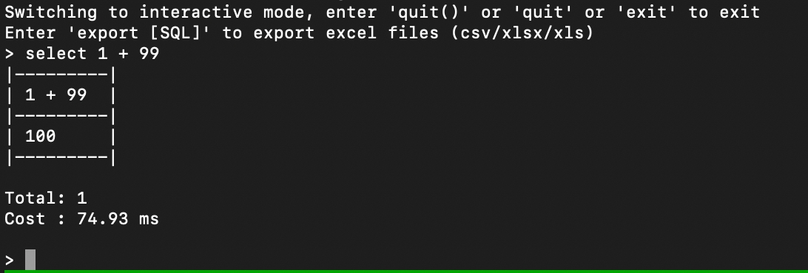

# omnidb_mug

Simple command line console tool for OmniDB.

```sh
python3 -m pip install -r requirements.txt

# for exporting excel files
(git clone https://github.com/CurtisNewbie/excelparser.git; cd excelparser; python3 -m pip install .)

# start omnidb_mug
python3 src/main.py

# or you can use an alias to pass some environment configuration
alias mug="python3 /omnidb_mug/src/main.py --force-batch-export --user 'myname' --host 'myomnidb' --log '/tmp/ndb.log'"

# then simply type `ndb` to enter interactive mode
mug

# or scripting mode
mug --script myscript.sql
```

- Omnidb >= 2.15: https://github.com/OmniDB/OmniDB/tree/2.15.0
- WebSocket Client Lib: https://github.com/websocket-client/websocket-client/
- [CurtisNewbie/excelparser](https://github.com/CurtisNewbie/excelparser) is needed for exporting query result to excel files


It now supports auto-completion for schema names and table names (by typing TAB). Type `'USE {SCHEMA_NAME}'` to tell which database you want to use, you will still need to include the schema name in your queries because OmniDB doesn't support this.

By typing `'DESC {SCHEMA_NAME}.{TABLE_NAME}'`, the field names of the table will also be fed to auto-completion as well.

Pretty print can be enabled by appending the `\G` (case-insensitive) flag at the end of the query. For example:

```sql
select * from my_database.my_table limit 1 \G
```

More **Special Commands**:

- `\reconnect` to reconnect the websocket
- `\change` to change the instance used
- `\export [SQL]` to export the result of query as an excel file
- `\debug` to enable/disable debug mode (only works in interactive session)

## Scripting

Scripting is also supported with the `--script YOUR_SCRIPTING_FILE`. The file should contain a bunch of SQLs that you want to execute one by one.

For example:

```sql
SELECT * FROM mydb.mytable WHERE id = 1;
SELECT * FROM mydb.mytable WHERE id = 2;
SELECT * FROM mydb.mytable WHERE id = 3;
```

## Demo


